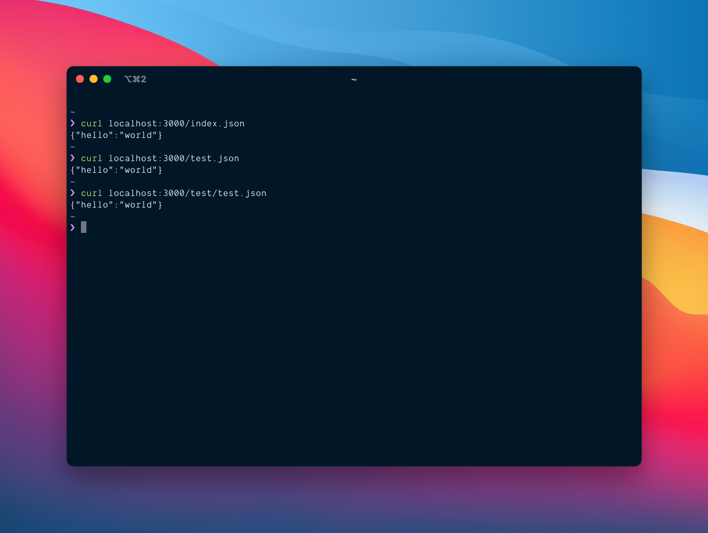
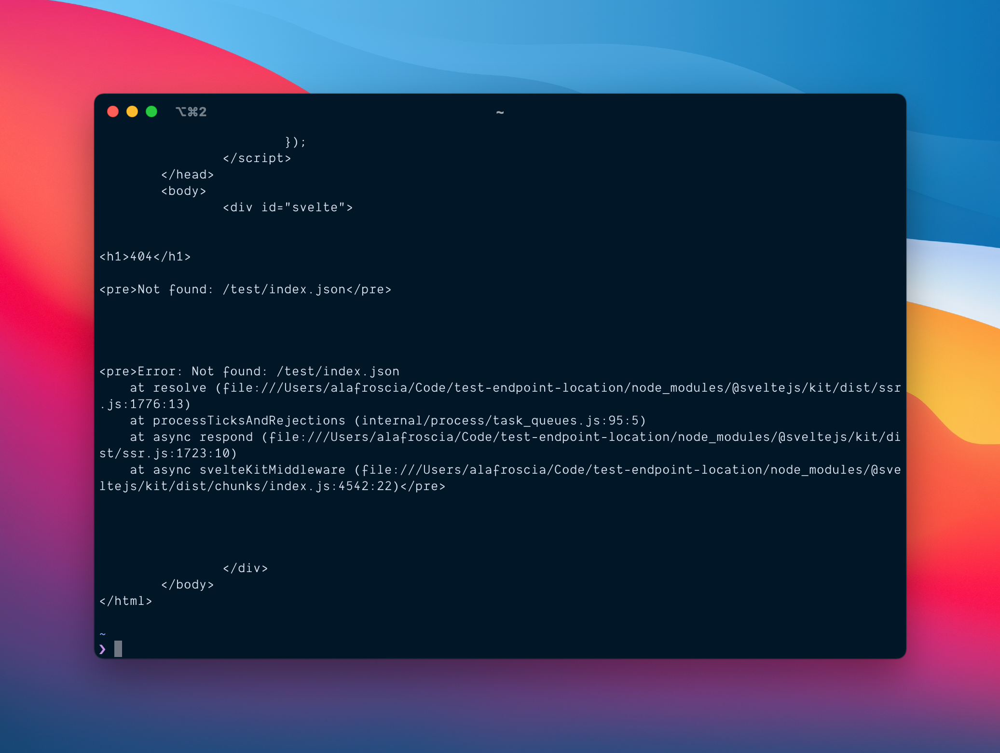

# Endpoint Naming Bug Demonstation

This repository demonstrates what I _think_ is a bug in SvelteKit around defining endpoints.

I am not _exactly_ sure what the bug is, but the result in my app is that an endpoint named `index.json.js` nested anywhere other than the root of the URL structure results in a `404` when it should not.

Four endpoints have been defined:

1. `/index.json`
2. `/test.json`
3. `/test/index.json`
4. `/test/test.json`

1, 2 and 4 all work as-expected; they return the following payload

```json
{ "hello": "world" }
```



3, however, results in a `404` error being triggered by SvelteKit.



I've read over the documentation again and again and can't find anything that would suggest that what is happening in this repository matches the expected or desired behavior.

## Local Reproduction

1. Clone repository
2. `npm install`
3. `npm run dev`
4. Use `curl` to hit one of the endpoints, like

   ```sh
   curl localhost:3000/test/index.json
   ```
